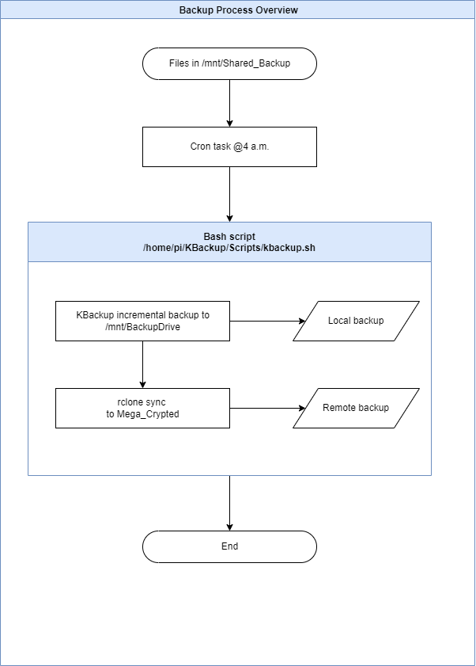

# Create backup script and cron task

Create a bash script that will execute the backup. The script will:

* Run kbackup from command line to backup files from **/mnt/Shared_Backup** to **/mnt/BackupDrive**
* Write the results in a log file[^1]
* Sync the content of **/mnt/BackupDrive** to rclone crypted storage **Mega_Crypted:**

## The script

```bash
#!/bin/bash
# Run kbackup with specified profile in background.
# To be executed as a cron task.

# 1. Create filename from current date and time.
# 2. Backup using profile and redirect stdout and stderr to said file.
filedate=$(date +%Y%m%d-%H%M)
filename="/home/pi/KBackup/Logs/"$filedate".log"
kbackup --verbose --autobg /home/pi/KBackup/Profiles/profile.kbp &> $filename

# 3. Sync backup drive with cloud storage (Mega)
rclone sync /mnt/BackupDrive/ Mega_Crypted:/
```

Save this script as **/home/pi/KBackup/Scripts/kbackup.sh**.  
Make the script executable:  

`sudo chmod 777 kbackup.sh`

Create a folder for the logs:  
`mkdir /home/pi/KBackup/Logs`

## Create cron task

Edit crontab file using command

`crontab -e`

and add a line for running the kbackup script. It should like something like

```text
0 4 * * * /home/pi/KBackup/Scripts/kbackup.sh
```

## The overview of the backup process



[^1]: I don't have any solution for automatic error alerts from the log files or automatic removal of the log files.
