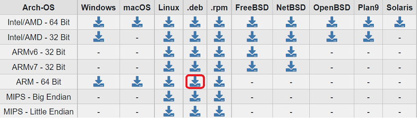

# Create rclone Drives

Create a Mega.nz account.

## Install rclone

Install rclone on Raspberry Pi.  
Make sure you have the latest version available.  
There might be an older version in the *apt* repository which does not support Mega.nz or other cloud storages.
Links:  

* <https://rclone.org/downloads/>
* <https://pimylifeup.com/raspberry-pi-rclone/>

For installing a **.deb** package use the command

`sudo apt install ./whatever-package.deb`

## Create a Mega Account

Not described here. Make sure to store the password.  
Also note that Mega storage is not completely safe because of security issues or in case the password is compromised.  
So encrypting the files using rclone might be a good option. The process is described in the following step.

## Create Mega storage

1. Create a normal *Mega* storage in rclone.  
    The storage name in rclone will be **Mega**  
    This storage will be only encrypted by the cloud provider. See [creating Mega storage](https://rclone.org/mega/).  
    When configuring the drive in rclone, use the Mega login name and password.

2. Create a rclone crypted storage based on **Mega**  
    Name the storage **Mega_Crypted**. Enter **Mega** as the name of storage to be encrypted.  
    The storage will be encrypted by rclone.  
    Choose not to encrypt the filenames, only add **.bin** extension.  
    Choose not to encrypt directory names.  

You can check the rclone remotes using the command

`rclone listremotes`

