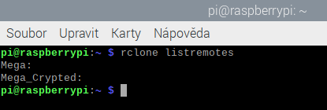

# Create rclone Drives

Create a Mega.nz account.

## Install rclone

Install rclone on Raspberry Pi.  
Make sure you have the latest version available.  
There might be an older version in the *apt* repository which does not support Mega.nz or other cloud storages.
Links:  

* <https://rclone.org/downloads/>
* <https://pimylifeup.com/raspberry-pi-rclone/>

## Create Mega storage

1. Create a normal *Mega* storage in rclone.  
    The storage name in rclone will be **Mega:**  
    This storage will be only encrypted by the cloud provider.

2. Create a rclone crypted storage based on **Mega:**  
    Name the storage **Mega_Crypted:**  
    The storage will be encrypted by rclone.

You can check the rclone remotes using the command

`rclone listremotes`

