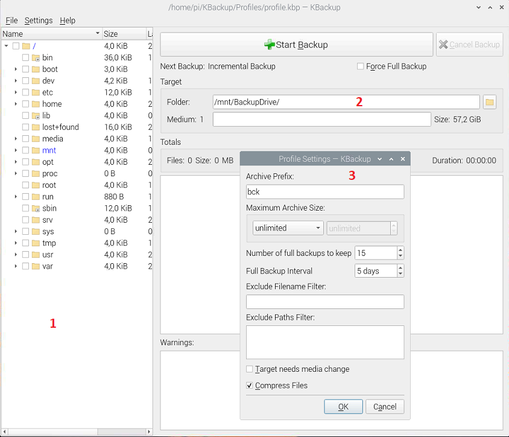

# Install the KBackup software

[KBackup](https://docs.kde.org/stable5/en/kbackup/kbackup/) is an older software that can perform [incremental backups](https://www.easeus.com/backup-utility/differential-backup-vs-incremental-backup.html). The application has a GUI but can also run from command line.

## Creating a profile

1. Open KBackup GUI
2. In pane (1) select folders to backup
3. In textbox (2) input the backup target  
    In our case it's the USB thumb drive mounted to /mnt/BackupDrive.
4. Open profile settings dialog (3) and set profile details, namely:
    * how many full backups to keep
    * full backup interval[^1]
    * whether to compress archived files[^2]
5. Save the profile to **/home/pi/KBackup/Profiles/profile.kbp**



## Running KBackup from command line

KBackup can be executed from command line in silent mode. File with saved profile is provided as an argument.  

```bash
kbackup --autobg /home/pi/KBackup/Profiles/profile.kbp
```

[^1]: If the interval is greater than 1, *all* backups following a full backup will be incremental. That means, even if you do 100 backups after a full backup,
they all will be incremental until it's time for another full backup.  
[^2]: In my case **xz** archive was used instead of expected **gzip**. There is no setting for this, it depends on what is available on the system.
