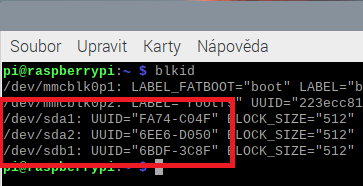

# Setup mount points

Have Linux mount the M.2 disk and USB disk to user-defined mounting points.

## Use blkid to get IDs of the partitions

The output should look something like this:



## Edit fstab file

Edit **/etc/fstab** file e.g. using nano:

`sudo nano /etc/fstab`

Use partition IDs obtained in the previous step to specify mounting points:

```text
#Mount M.2 disk
UUID=FA74-C04F  /mnt/Shared_Backup    exfat auto,nofail,noatime,users,rw,uid=pi,gid=pi  0  0
UUID=6EE6-D050  /mnt/Shared_Nobackup  exfat auto,nofail,noatime,users,rw,uid=pi,gid=pi  0  0
#Mount USB thumb drive
UUID=6BDF-3C8F  /mnt/BackupDrive      exfat auto,nofail,noatime,users,rw,uid=pi,gid=pi  0  0
```

## Verify that the mounting works

Restart Raspberry Pi or execute

`sudo mount -a`

which will mount the drives listed in **fstab**
